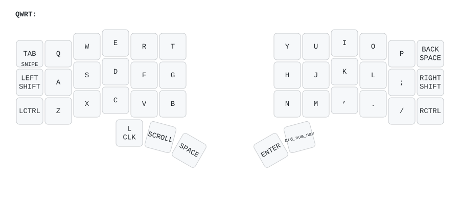

[](https://github.com/Cyb3rDudu/zmk-charybdis/actions/workflows/build.yml)

## Intro

Personal ZMK firmware configuration for a [Wireless Charybdis 3x6](https://github.com/280Zo/charybdis-wireless-mini-3x6-build-guide) split keyboard with PMW3610 trackball, built on Nice!Nano v2 controllers. It supports both Bluetooth/USB and 2.4 GHz dongle configurations.

This is a standalone configuration (not a git fork). It started from [280Zo's firmware](https://github.com/280Zo/charybdis-wireless-mini-zmk-firmware) in early 2026 and has since diverged into its own keymap, behavior set, CI and build tooling.

## Firmware Stack

All dependencies are pinned to fixed revisions in [`config/west.yml`](config/west.yml):

| Component | Revision | Source |
| ---------- | -------- | ------ |
| ZMK | `268b1b1e` | [zmkfirmware/zmk](https://github.com/zmkfirmware/zmk) |
| PMW3610 driver | `44b4a76` | [badjeff/zmk-pmw3610-driver](https://github.com/badjeff/zmk-pmw3610-driver) |
| Board | `nice_nano//zmk` (nRF52840) | — |

Firmware builds are produced by GitHub Actions on every push to `main`; artifacts land under the Actions tab.

## Quick Start

### Flashing the Firmware

Download the firmware from a recent [Actions run](https://github.com/Cyb3rDudu/zmk-charybdis/actions) (or build locally, see below). Then:

1. Plug the right half into the computer through USB
2. Double press the reset button
3. The keyboard mounts as a removable storage device
4. Copy the applicable `.uf2` file into the NICENANO storage device (e.g. `charybdis_right.uf2` → right half)
5. It unmounts and restarts itself after a few seconds
6. Repeat for all devices

> [!NOTE]
> When flashing for the first time, or when switching between the dongle and the Bluetooth/USB configuration, flash the `settings_reset` firmware to all devices first.

### Overview & Usage



To see all layers check out the [full render](keymap-drawer/qwerty.svg).

#### Layers
| # | Layer      | Access                                        | Purpose                                        |
| - | ---------- | --------------------------------------------- | ---------------------------------------------- |
| 0 | **QWRT**   | Default                                       | Standard QWERTY typing                         |
| 1 | **NUM**    | Hold right thumb (K40)                        | Numbers, brackets, symbols, arithmetic          |
| 2 | **NAV**    | Double-tap right thumb (K40) and hold         | Desktop switching, Mission Control, clipboard   |
| 3 | **SCROLL** | Hold left thumb (K37)                         | Trackball scrolling, arrows, paste w/o format   |
| 4 | **SNIPE**  | Hold top-left key (TAB)                        | F-keys, Bluetooth, media, brightness            |

#### Thumb Cluster

Both middle thumb keys are tap-dances with a 280 ms press-to-press window:

| Key | Left hand                                          | | Key | Right hand                                          |
| --- | -------------------------------------------------- | - | --- | --------------------------------------------------- |
| K36 | Left mouse click (right-click on NUM)               | | K39 | Enter                                                |
| K37 | Hold: **SCROLL**                                     | | K40 | Hold: **NUM** · double-tap+hold: **NAV**              |
| K38 | Space                                               | |     |                                                     |

#### Key Highlights

- **Right thumb tap-dance:** hold fires NUM instantly; a quick double-tap followed by holding the key switches to NAV for as long as it is held (see `td_num_nav` in `config/keymap/behaviors.dtsi`)
- **Layer-tap on TAB:** tap for Tab, hold for the SNIPE layer
- **NAV layer:** `Cmd+Opt+←/→` desktop switching on J/L, Mission Control (`Ctrl+↑`) and the window switcher on the thumb arc, paste-without-formatting (`Cmd+Shift+V`)
- **NUM layer:** numbers on home row, brackets and quotes on top row, `Ctrl+S` and word-wise selection, right-click on the left thumb
- **SCROLL layer:** trackball scrolls, arrows on IJKL, `Cmd+Shift+V`
- **Bluetooth profile switching:** `BT_SEL 0-2` and `BT_CLR` via SNIPE, with on-keyboard passkey entry enabled
- **Bluetooth tuning:** `+8 dBm` TX power, raised ATT/L2CAP buffers, longer peripheral latency — see `config/charybdis.conf`
- **Caps Word:** continues on `_` and `-`
- **PMW3610 trackball:** input processors (speed, acceleration, scroll tuning) in `config/charybdis_pointer.dtsi`, hardware config in `config/charybdis_pmw3610.dtsi`

## Customizing

- **ZMK Studio** is enabled on the Bluetooth right half for runtime keymap changes. Physical key positions live in `charybdis-layouts.dtsi` ([layout converter](https://zmk-physical-layout-converter.streamlit.app/) if you need to change them).
- **Keymap:** edit `config/keymap/qwerty.keymap` directly; custom behaviors live in `config/keymap/behaviors.dtsi`. Keycode reference: [ZMK docs](https://zmk.dev/docs/codes).
- **Trackball:** everything pointer-related is grouped in `config/charybdis_pointer.dtsi`.

### Building Locally

The containerized build compiles every shield × keymap and the `settings_reset` firmware in one go:

```sh
# Docker Compose
cd local-build && docker-compose run --rm builder

# or plain Podman
podman run --rm -v "$PWD:/workspaces/zmk:rw" -w /workspaces/zmk -t \
  zmkfirmware/zmk-dev-arm:stable bash ./local-build/build_setup.sh
```

Artifacts land in `firmwares/`. Details and caveats: [local-build README](local-build/README.md).

### GitHub Actions

Push to `main` and the workflow builds all firmware combos; keymap drawings are regenerated automatically on every change.

### Troubleshooting

- If the halves don't connect, press reset on both halves simultaneously; otherwise follow the [ZMK connection issues guide](https://zmk.dev/docs/troubleshooting/connection-issues).
- When changing shields or BT profiles, flash `settings_reset` first (see note above).

## Credits & Lineage

- [280Zo](https://github.com/280Zo/charybdis-wireless-mini-zmk-firmware) — the firmware this config started from, and the wireless Charybdis build guide
- [badjeff](https://github.com/badjeff) — the PMW3610 ZMK driver this repo pins directly
- [caksoylar](https://github.com/caksoylar/keymap-drawer) — automated keymap drawings
- [eigatech](https://github.com/eigatech), [nickcoutsos](https://github.com/nickcoutsos/keymap-editor), [urob](https://github.com/urob/zmk-config) — upstream heritage of the original config
